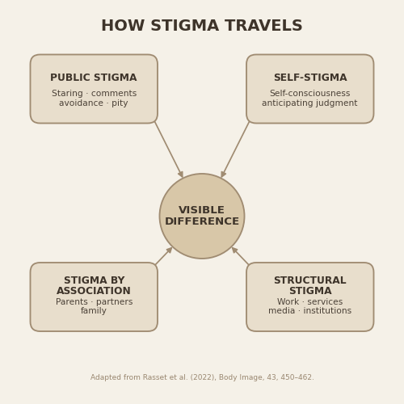

# How Stigma Travels

Python code used to generate a conceptual illustration for a Semish Kemin essay on visible difference and stigma.

The diagram summarizes four forms of stigma discussed in the social stigma framework applied to facial difference:

- Public stigma
- Self-stigma
- Stigma by association
- Structural stigma

## Figure



The illustration is generated entirely in Python with Matplotlib.

## Run

### Windows

```bash
python -m venv .venv
.venv\Scripts\activate
pip install -r requirements.txt
python stigma_diagram.py
```

### macOS / Linux

```bash
python3 -m venv .venv
source .venv/bin/activate
pip install -r requirements.txt
python3 stigma_diagram.py
```

## Source

Rasset, P., Mange, J., Montalan, B., & Stutterheim, S. E. (2022).  
“Towards a better understanding of the social stigma of facial difference.”  
*Body Image, 43*, 450–462.  
https://doi.org/10.1016/j.bodyim.2022.10.011

The paper applies the social stigma framework of Pryor and Reeder (2011) to facial difference and discusses four forms of stigma: public stigma, self-stigma, stigma by association, and structural stigma.

This repository contains an original visualization of those categories; it does not reproduce a figure from the paper.

## Essay

Semish Kemin on Substack:  
https://substack.com/@semishkemin

## License

Code is released under the MIT License.

The research article and its contents remain subject to the rights of their respective authors and publisher.
